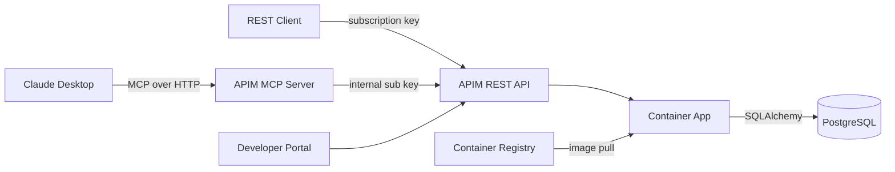

# AGENT.md — azure-apim-mcp-server

## Project Overview
Microelectronics semiconductor orders API deployed to Azure Container Apps, exposed through Azure API Management (StandardV2) as both a REST API and MCP (Model Context Protocol) server.

## Architecture



### Request Flows

**REST API flow**: Client → APIM REST API (`/orders/api/v1/*`, subscription key + CORS) → Container App (FastAPI) → PostgreSQL

**MCP flow**: Claude Desktop → APIM MCP Server (`/st-orders-mcp/mcp`, subscription key, Streamable HTTP) → APIM translates JSON-RPC tool calls into REST API operations → routes to APIM REST API (internal subscription key + CORS) → Container App (FastAPI) → PostgreSQL → response flows back as JSON-RPC result

**Key points**:
- The MCP flow is handled entirely by APIM's native MCP gateway — no custom MCP code runs on the Container App
- MCP tool calls route **through the APIM REST API** (not directly to the Container App), so all REST API policies (CORS, rate limiting) are applied consistently in one place
- The MCP API's `serviceUrl` points to the APIM REST API endpoint (`/orders`), and an internal subscription key (stored as a named value) is injected via `set-header` policy
- Easy Auth on Container App is **disabled** — access control is handled at the APIM layer via subscription keys

## Tech Stack

| Component | Technology |
|-----------|-----------|
| API Framework | FastAPI (Python 3.11) |
| Database | PostgreSQL 16 (Azure Flexible Server in prod, Docker locally) |
| ORM | SQLAlchemy 2.0 (async) |
| Migrations | Alembic |
| MCP Server | APIM native MCP gateway (`apiType: 'mcp'`) — zero custom code |
| Infrastructure | Azure Bicep |
| Hosting | Azure Container Apps |
| API Gateway | Azure API Management (StandardV2 tier) |
| Auth | APIM subscription keys (Easy Auth disabled) |
| CI/CD | GitHub Actions |
| Container Registry | Azure Container Registry |
| Secrets | Azure Key Vault |

## Local Development

### Prerequisites
- Docker & Docker Compose
- Python 3.11+

### Quick Start
```bash
# Clone the repo
git clone https://github.com/ozgurkarahan/azure-apim-mcp-server.git
cd azure-apim-mcp-server

# Start services
docker-compose up --build

# API available at http://localhost:8000/docs
```

### Running Tests
```bash
pip install -r requirements-dev.txt
pytest tests/ -v
```

### Linting
```bash
ruff check src/ tests/
```

### Database Migrations
```bash
alembic upgrade head
alembic revision --autogenerate -m "description"
```

## Code Conventions
- SQLAlchemy 2.0 style (mapped_column, Mapped types)
- UUIDs as primary keys for all tables
- Pydantic v2 model_config style (no class Config)
- All API routes under `/api/v1/`
- Health checks at `/health` and `/health/db`
- Order number format: `ST-ORD-YYYYMM-NNNN`
- Async SQLAlchemy sessions throughout
- Service layer pattern: routers -> services -> database

## Environment Variables
- `DATABASE_URL` — PostgreSQL connection string (uses `postgresql+asyncpg://` scheme). **Password must not contain `@`** — it breaks URL parsing (the `@` is interpreted as the user:password@host separator).
- `ENVIRONMENT` — dev/staging/production
- `LOG_LEVEL` — logging level (default: info)
- `API_BASE_URL` — base URL for MCP server to reach the REST API (default: http://localhost:8000)

## API Reference

All endpoints are under `/api/v1/`.

| Method | Path | Description |
|--------|------|-------------|
| GET | `/health` | Health check |
| GET | `/health/db` | Database connectivity check |
| GET | `/api/v1/products` | List products (filter: category, family, search) |
| POST | `/api/v1/products` | Create product |
| GET | `/api/v1/products/{id}` | Get product |
| PUT | `/api/v1/products/{id}` | Update product |
| DELETE | `/api/v1/products/{id}` | Soft-delete product |
| GET | `/api/v1/customers` | List customers (filter: search, country) |
| POST | `/api/v1/customers` | Create customer |
| GET | `/api/v1/customers/{id}` | Get customer |
| PUT | `/api/v1/customers/{id}` | Update customer |
| GET | `/api/v1/orders` | List orders (filter: status, customer_id) |
| POST | `/api/v1/orders` | Create order (auto-calculates totals) |
| GET | `/api/v1/orders/{id}` | Get order with items |
| PUT | `/api/v1/orders/{id}` | Update order |
| DELETE | `/api/v1/orders/{id}` | Cancel order |

## Database Models

| Table | Key Fields | Relationships |
|-------|-----------|---------------|
| **customers** | id, company_name, contact_name, contact_email, phone, address, city, country | 1:N orders |
| **products** | id, part_number (unique), name, description, category, family, unit_price, currency, stock_quantity, lead_time_days, is_active | 1:N order_items |
| **orders** | id, order_number (unique), customer_id (FK), status (enum), total_amount, currency, shipping_address, notes, ordered_at, shipped_at, delivered_at | N:1 customer, 1:N items |
| **order_items** | id, order_id (FK), product_id (FK), quantity, unit_price, line_total | N:1 order, N:1 product |

**OrderStatus enum**: pending, confirmed, processing, shipped, delivered, cancelled

## Seed Data
- **28 products** across Microelectronics families: STM32F4, STM32L4, STM32H7, STM32G0, STM32F1, STM32WB, STM8S (MCUs), LIS/LSM/LPS/HTS (MEMS sensors), STF/STD (power MOSFETs), L78/ST1S (power management), L6/L298 (motor drivers), BlueNRG (wireless), TSV/TSH (op-amps)
- **10 customers**: Fictional electronics companies across Germany, Japan, USA, South Korea, China, UK, France, Italy, Sweden, Canada
- **40 orders**: Distributed across statuses (~30% delivered, ~25% shipped, ~20% processing, ~15% confirmed, ~10% pending), 1-5 items each, spanning last 6 months

## Azure Deployment

### Primary: Deploy with `azd`
```bash
azd init -e dev
azd env set PUBLISHER_EMAIL <email>
azd env set POSTGRES_ADMIN_PASSWORD <password-without-@>
azd up
```

**How it works:** `azd up` runs a two-phase deployment orchestrated by `azure.yaml`:
1. **Phase 1** — Provisions infrastructure via `infra/main.bicep` (using `main.bicepparam`) and builds/deploys the app container
2. **Phase 2** — The `postdeploy` hook (`hooks/postdeploy.sh` / `.ps1`) waits for health check, then re-runs Bicep with `DEPLOY_API_CONFIG=true` to import OpenAPI spec + configure MCP

**Key environment variables** (set via `azd env set`, read by `main.bicepparam`):
- `PUBLISHER_EMAIL` (required) — APIM publisher email
- `POSTGRES_ADMIN_PASSWORD` (required) — must not contain `@`
- `AUTH_CLIENT_ID` (optional) — Entra ID App Registration client ID
- `AI_FOUNDRY_PRINCIPAL_ID` (optional) — AI Foundry MI for APIM role assignment

### Secondary: GitHub Actions CI/CD
The `.github/workflows/deploy.yml` workflow runs on push to `main` with 4 jobs: deploy-infrastructure → build-and-push → deploy-app → configure-apim. Requires `AZURE_CREDENTIALS`, `AZURE_RESOURCE_GROUP`, `POSTGRES_ADMIN_PASSWORD`, and `PUBLISHER_EMAIL` as GitHub secrets.

> Note: APIM StandardV2 takes ~5 min to provision (much faster than the old Developer tier). Container App and APIM deploy sequentially due to Bicep dependency ordering.

### Azure Resources (via Bicep)
1. **User-assigned Managed Identity** — used by Container App to pull from ACR
2. **Key Vault** — stores PostgreSQL admin password
3. **Azure Container Registry** (Basic SKU) — hosts Docker images
4. **PostgreSQL Flexible Server** (Burstable B1ms, v16, 32GB) + database `storders`
5. **Container Apps Environment + Container App** — runs FastAPI on port 8000, min 1 / max 3 replicas
6. **API Management** (StandardV2 tier, system-assigned MI) — gateway for REST API + MCP
7. **APIM REST API** (`st-orders-api`) — imported from OpenAPI spec, exposes `/orders/api/v1/*`
8. **APIM MCP API** (`st-orders-mcp`, `apiType: 'mcp'`) — exposes 8 REST operations as MCP tools at `/st-orders-mcp/mcp`, routes tool calls through the APIM REST API (not directly to backend)
9. **Easy Auth** (Container App authConfig) — **disabled**; config retained for optional re-enablement with v2 token issuer

### Bicep Module Dependency Graph
```
identity ──┬── keyvault
            ├── acr ──────────┐
            │                  ▼
apim ──────┬── containerApp (depends on: identity, acr, postgres, apim)
            │       │
            │       ▼
            ├── apimApi (depends on: apim, containerApp)
            │       │
            │       ▼
            └── apimMcp (depends on: apim, apimApi)

postgres ──────────┘
```

### CI/CD (GitHub Actions)
- **ci.yml**: Runs on PRs — lint with ruff, test with pytest
- **deploy.yml**: Runs on push to main — 4-phase pipeline: deploy-infrastructure → build-and-push → deploy-app → configure-apim (health check + Phase 2 Bicep with API import + MCP config)

### Required GitHub Secrets
- `AZURE_CREDENTIALS` — service principal JSON (SP needs Contributor + User Access Administrator roles)
- `AZURE_RESOURCE_GROUP` — resource group name
- `POSTGRES_ADMIN_PASSWORD` — PostgreSQL admin password
- `PUBLISHER_EMAIL` — APIM publisher email
- `AUTH_CLIENT_ID` — (optional) Entra ID App Registration client ID
- `AI_FOUNDRY_PRINCIPAL_ID` — (optional) AI Foundry MI principal ID

## APIM Configuration
- API imported from Container App's `/openapi.json`
- **Product**: "ST Orders API - Free" (100 calls/min, self-service subscription)
- **REST API policies**: CORS (allow Developer Portal), rate limiting
- **MCP API policy**: `set-header` injects internal subscription key to route calls through the REST API
- **Named value**: `st-orders-internal-key` — subscription key used by MCP API to call the REST API internally
- REST API available at: `https://<apim>.azure-api.net/orders/api/v1/*`
- MCP API available at: `https://<apim>.azure-api.net/st-orders-mcp/mcp` (serviceUrl → `/orders`)

## Authentication

Access control is handled at the APIM layer via **subscription keys**. Easy Auth on the Container App is **disabled**.

**REST API flow**: Client → APIM REST API (subscription key required) → Container App (no auth) → Backend

**MCP flow**: Client → APIM MCP Server (subscription key) → APIM REST API (internal subscription key via `set-header`) → Container App → Backend

## MCP Server

### APIM-native MCP — Zero custom code
- APIM natively converts the imported REST API into an MCP server
- Endpoint: `https://<apim>.azure-api.net/st-orders-mcp/mcp`
- Transport: Streamable HTTP (JSON-RPC 2.0 over SSE), auth via subscription key
- Deployed via Bicep: `infra/modules/apim-mcp.bicep` (uses `apiType: 'mcp'` + `type: 'mcp'` with API version `2025-03-01-preview`)
- **Routes through APIM REST API**: `serviceUrl` points to the APIM REST API endpoint (`/orders`), not directly to the Container App. Internal subscription key injected via `set-header` policy and stored as named value `st-orders-internal-key`.
- 8 MCP tools mapped to REST API operations: list_products, get_product, list_customers, get_customer, list_orders, get_order, create_order, update_order_status
- Linked to the `st-orders-free` product — same subscription key works for both REST and MCP
- Tool names match the FastAPI-generated operationIds (e.g., `list_products_api_v1_products_get`)

#### How APIM-native MCP works
1. MCP client sends JSON-RPC request (e.g., `tools/call` with `name: "list_products_api_v1_products_get"`)
2. APIM MCP gateway matches the tool name to the corresponding REST API operation in `st-orders-api`
3. APIM translates the tool arguments into a REST request (query params, path params, body)
4. APIM MCP inbound policy injects the internal subscription key via `set-header`
5. APIM sends the REST request to the APIM REST API endpoint (`/orders/api/v1/...`)
6. APIM REST API applies CORS + rate limiting, then forwards to the Container App backend
7. Response flows back: Container App → REST API → MCP gateway → JSON-RPC result streamed via SSE

#### Bicep schema notes
- MCP API and policy use API version `2025-03-01-preview` (preview); all other child resources use `2024-05-01` (required for StandardV2 compatibility)
- Must set **both** `apiType: 'mcp'` and `type: 'mcp'` in properties
- `mcpTools` array uses `name` (operation name) + `operationId` (full ARM resource ID)
- Bicep shows `BCP037` warnings for MCP properties — these are expected and can be ignored
- Subscription key for internal routing is read via `listSecrets()` on the existing subscription and stored as a secret named value

### Client Configuration (APIM)
```json
{
  "mcpServers": {
    "st-orders": {
      "type": "http",
      "url": "https://<apim>.azure-api.net/st-orders-mcp/mcp",
      "headers": {
        "Ocp-Apim-Subscription-Key": "<your-subscription-key>"
      }
    }
  }
}
```

### Testing MCP Endpoint
```bash
# Initialize session
curl -X POST "https://<apim>.azure-api.net/st-orders-mcp/mcp" \
  -H "Ocp-Apim-Subscription-Key: <key>" \
  -H "Content-Type: application/json" \
  -H "Accept: application/json, text/event-stream" \
  -d '{"jsonrpc":"2.0","method":"initialize","id":1,"params":{"protocolVersion":"2025-03-26","capabilities":{},"clientInfo":{"name":"test","version":"1.0"}}}'

# List available tools
curl -X POST ... -d '{"jsonrpc":"2.0","method":"tools/list","id":2}'

# Call a tool
curl -X POST ... -d '{"jsonrpc":"2.0","method":"tools/call","id":3,"params":{"name":"list_products_api_v1_products_get","arguments":{"category":"Microcontrollers","limit":"2"}}}'
```

## Project Structure
```
├── AGENT.md              # Project instructions for code agents
├── .github/workflows/    # CI (lint+test) and Deploy (4-phase pipeline)
├── hooks/                # azd lifecycle hooks (postdeploy = Phase 2 Bicep)
├── infra/                # Azure Bicep templates (main + 8 modules)
│   ├── main.bicep        # Orchestrator
│   ├── main.bicepparam   # Parameters (reads env vars via readEnvironmentVariable)
│   └── modules/
│       ├── managed-identity.bicep
│       ├── keyvault.bicep
│       ├── acr.bicep
│       ├── postgresql.bicep
│       ├── container-app.bicep
│       ├── apim.bicep
│       ├── apim-api.bicep      # REST API import + product + subscription
│       └── apim-mcp.bicep       # MCP server (routes through REST API)
├── src/app/              # FastAPI application
│   ├── main.py           # Entry point
│   ├── config.py         # pydantic-settings
│   ├── database.py       # SQLAlchemy engine/session
│   ├── models/           # customer, product, order, order_item
│   ├── schemas/          # Pydantic schemas per entity
│   ├── routers/          # health, customers, products, orders
│   ├── services/         # Business logic per entity
│   └── seed.py           # Microelectronics themed seed data
├── alembic/              # Database migrations
├── tests/                # Pytest test suite
├── azure.yaml            # Azure Developer CLI project config
├── Dockerfile            # Multi-stage Python 3.11-slim
└── docker-compose.yml    # Local dev (PostgreSQL + app)
```
