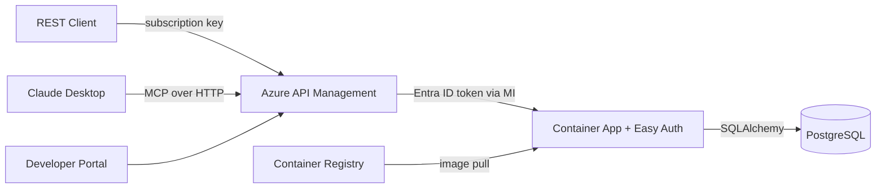

# CLAUDE.md — azure-apim-mcp-server

## Project Overview
Microelectronics semiconductor orders API deployed to Azure Container Apps, exposed through Azure API Management as both a REST API and MCP (Model Context Protocol) server, with Developer Portal.

## Architecture



### Request Flows

**REST API flow**: Client → APIM (`/orders/api/v1/*`, subscription key) → APIM acquires Entra ID token via system-assigned MI → Container App validates token via Easy Auth → FastAPI → PostgreSQL

**MCP flow**: Claude Desktop → APIM (`/st-orders-mcp/mcp`, subscription key, Streamable HTTP) → APIM translates JSON-RPC tool calls into REST API operations → APIM acquires Entra ID token via MI → Container App → FastAPI → PostgreSQL → response flows back as JSON-RPC result

**Key difference**: The MCP flow is handled entirely by APIM's native MCP gateway — no custom MCP code runs on the Container App. APIM receives JSON-RPC requests, maps tool names to REST operations, calls the backend, and wraps the response back into JSON-RPC format.

## Tech Stack

| Component | Technology |
|-----------|-----------|
| API Framework | FastAPI (Python 3.11) |
| Database | PostgreSQL 16 (Azure Flexible Server in prod, Docker locally) |
| ORM | SQLAlchemy 2.0 (async) |
| Migrations | Alembic |
| MCP Server (APIM) | APIM native MCP gateway (`apiType: 'mcp'`) — zero custom code |
| MCP Server (local) | Python `mcp` SDK (FastMCP) — for stdio/local dev |
| Infrastructure | Azure Bicep |
| Hosting | Azure Container Apps |
| API Gateway | Azure API Management (Developer tier) |
| Auth | Microsoft Entra ID (Easy Auth + Managed Identity) |
| CI/CD | GitHub Actions |
| Container Registry | Azure Container Registry |
| Secrets | Azure Key Vault |

## Local Development

### Prerequisites
- Docker & Docker Compose
- Python 3.11+

### Quick Start
```bash
# Clone the repo
git clone https://github.com/ozgurkarahan/azure-apim-mcp-server.git
cd azure-apim-mcp-server

# Start services
docker-compose up --build

# API available at http://localhost:8000/docs
```

### Running Tests
```bash
pip install -r requirements-dev.txt
pytest tests/ -v
```

### Linting
```bash
ruff check src/ tests/
```

### Database Migrations
```bash
alembic upgrade head
alembic revision --autogenerate -m "description"
```

### MCP Server (Local/Standalone)
```bash
# Via stdio (for Claude Desktop / VS Code)
python -m src.mcp_server.server

# Set API_BASE_URL if the API runs on a different host
API_BASE_URL=http://localhost:8000 python -m src.mcp_server.server
```

## Code Conventions
- SQLAlchemy 2.0 style (mapped_column, Mapped types)
- UUIDs as primary keys for all tables
- Pydantic v2 model_config style (no class Config)
- All API routes under `/api/v1/`
- Health checks at `/health` and `/health/db`
- Order number format: `ST-ORD-YYYYMM-NNNN`
- Async SQLAlchemy sessions throughout
- Service layer pattern: routers -> services -> database

## Environment Variables
- `DATABASE_URL` — PostgreSQL connection string (uses `postgresql+asyncpg://` scheme). **Password must not contain `@`** — it breaks URL parsing (the `@` is interpreted as the user:password@host separator).
- `ENVIRONMENT` — dev/staging/production
- `LOG_LEVEL` — logging level (default: info)
- `API_BASE_URL` — base URL for MCP server to reach the REST API (default: http://localhost:8000)

## API Reference

All endpoints are under `/api/v1/`.

| Method | Path | Description |
|--------|------|-------------|
| GET | `/health` | Health check |
| GET | `/health/db` | Database connectivity check |
| GET | `/api/v1/products` | List products (filter: category, family, search) |
| POST | `/api/v1/products` | Create product |
| GET | `/api/v1/products/{id}` | Get product |
| PUT | `/api/v1/products/{id}` | Update product |
| DELETE | `/api/v1/products/{id}` | Soft-delete product |
| GET | `/api/v1/customers` | List customers (filter: search, country) |
| POST | `/api/v1/customers` | Create customer |
| GET | `/api/v1/customers/{id}` | Get customer |
| PUT | `/api/v1/customers/{id}` | Update customer |
| GET | `/api/v1/orders` | List orders (filter: status, customer_id) |
| POST | `/api/v1/orders` | Create order (auto-calculates totals) |
| GET | `/api/v1/orders/{id}` | Get order with items |
| PUT | `/api/v1/orders/{id}` | Update order |
| DELETE | `/api/v1/orders/{id}` | Cancel order |

## Database Models

| Table | Key Fields | Relationships |
|-------|-----------|---------------|
| **customers** | id, company_name, contact_name, contact_email, phone, address, city, country | 1:N orders |
| **products** | id, part_number (unique), name, description, category, family, unit_price, currency, stock_quantity, lead_time_days, is_active | 1:N order_items |
| **orders** | id, order_number (unique), customer_id (FK), status (enum), total_amount, currency, shipping_address, notes, ordered_at, shipped_at, delivered_at | N:1 customer, 1:N items |
| **order_items** | id, order_id (FK), product_id (FK), quantity, unit_price, line_total | N:1 order, N:1 product |

**OrderStatus enum**: pending, confirmed, processing, shipped, delivered, cancelled

## Seed Data
- **28 products** across Microelectronics families: STM32F4, STM32L4, STM32H7, STM32G0, STM32F1, STM32WB, STM8S (MCUs), LIS/LSM/LPS/HTS (MEMS sensors), STF/STD (power MOSFETs), L78/ST1S (power management), L6/L298 (motor drivers), BlueNRG (wireless), TSV/TSH (op-amps)
- **10 customers**: Fictional electronics companies across Germany, Japan, USA, South Korea, China, UK, France, Italy, Sweden, Canada
- **40 orders**: Distributed across statuses (~30% delivered, ~25% shipped, ~20% processing, ~15% confirmed, ~10% pending), 1-5 items each, spanning last 6 months

## Azure Deployment

### Deploy Infrastructure
```bash
az group create --name rg-poc-apim --location swedencentral
az deployment group create \
  --resource-group rg-poc-apim \
  --template-file infra/main.bicep \
  --parameters environmentName=apim-mcp-dev \
    publisherEmail=<email> \
    postgresAdminPassword=<password-without-@> \
    authClientId=<app-registration-client-id> \
    containerImage=<acr>.azurecr.io/st-orders-api:latest
```

> Note: APIM Developer tier takes ~30-40 min to provision on first deploy, ~3 min on updates. Container App now depends on APIM (needs its `principalId` for Easy Auth), so they deploy sequentially.

### Azure Resources (via Bicep)
1. **User-assigned Managed Identity** — used by Container App to pull from ACR
2. **Key Vault** — stores PostgreSQL admin password
3. **Azure Container Registry** (Basic SKU) — hosts Docker images
4. **PostgreSQL Flexible Server** (Burstable B1ms, v16, 32GB) + database `storders`
5. **Container Apps Environment + Container App** — runs FastAPI on port 8000, min 1 / max 3 replicas
6. **API Management** (Developer tier, system-assigned MI) — gateway for REST API + MCP, authenticates to Container App via Entra ID
7. **APIM REST API** (`st-orders-api`) — imported from OpenAPI spec, exposes `/orders/api/v1/*`
8. **APIM MCP API** (`st-orders-mcp`, `apiType: 'mcp'`) — exposes 8 REST operations as MCP tools at `/st-orders-mcp/mcp`
9. **Easy Auth** (Container App authConfig) — Entra ID token validation on Container App

### Bicep Module Dependency Graph
```
identity ──┬── keyvault
            ├── acr ──────────┐
            │                  ▼
apim ──────┬── containerApp (depends on: identity, acr, postgres, apim)
            │       │
            │       ▼
            ├── apimApi (depends on: apim, containerApp)
            │       │
            │       ▼
            └── apimMcp (depends on: apim, apimApi)

postgres ──────────┘
```

### CI/CD (GitHub Actions)
- **ci.yml**: Runs on PRs — lint with ruff, test with pytest
- **deploy.yml**: Runs on push to main — build/push Docker image, deploy Bicep infra, update Container App, import OpenAPI spec into APIM

### Required GitHub Secrets
- `AZURE_CREDENTIALS` — service principal JSON
- `AZURE_RESOURCE_GROUP` — resource group name
- `POSTGRES_ADMIN_PASSWORD` — PostgreSQL admin password
- `PUBLISHER_EMAIL` — APIM publisher email
- `AUTH_CLIENT_ID` — Entra ID App Registration client ID for Easy Auth

## APIM Configuration
- API imported from Container App's `/openapi.json`
- **Product**: "ST Orders API - Free" (100 calls/min, self-service subscription)
- **Policies**: CORS (allow Developer Portal), rate limiting, managed identity auth
- REST API available at: `https://<apim>.azure-api.net/orders/api/v1/*`
- MCP API available at: `https://<apim>.azure-api.net/st-orders-mcp/mcp`

## Authentication (Entra ID + Easy Auth)

The Container App is secured with Microsoft Entra ID (Azure AD) authentication so it cannot be called directly, bypassing APIM.

**Flow**: Client → APIM (subscription key) → APIM acquires Entra ID token via system-assigned managed identity → Container App validates token via Easy Auth → Backend

### Components
- **App Registration**: Created via `az ad app create --display-name "st-orders-api"` (not possible in Bicep — it's a Microsoft Graph object). The `appId` output is used as `authClientId`. Must also create a Service Principal (`az ad sp create --id <appId>`) and set the Application ID URI (`az ad app update --id <appId> --identifier-uris "api://<appId>"`).
- **APIM System-Assigned Managed Identity**: APIM uses its MI to acquire tokens for audience `api://<authClientId>` via `<authentication-managed-identity>` policy.
- **Container App Easy Auth**: `Microsoft.App/containerApps/authConfigs` resource validates Entra ID tokens. Unauthenticated requests get 401. Authorized callers are specified via `allowedPrincipals.identities` using the APIM MI's `principalId`.
- **Excluded Paths**: `/health` and `/openapi.json` are excluded from auth for health probes and APIM OpenAPI import.

### App Registration Setup (CLI — not possible in Bicep)
```bash
# 1. Create the App Registration
az ad app create --display-name "st-orders-api" --sign-in-audience AzureADMyOrg

# 2. Set the Application ID URI (used as token audience)
az ad app update --id <appId> --identifier-uris "api://<appId>"

# 3. Create a Service Principal (required for token issuance)
az ad sp create --id <appId>
```

### Required Parameter
- `authClientId` — Client ID from the App Registration. Pass to Bicep deployment:
  ```bash
  az deployment group create ... --parameters authClientId=<app-registration-client-id>
  ```

### Key Design Decisions (from deployment lessons)

**v1 tokens, not v2**: APIM's `authentication-managed-identity` policy acquires tokens via the managed identity endpoint (IMDS), which always issues **v1 tokens** regardless of the App Registration's `requestedAccessTokenVersion` setting. The v1 token issuer is `https://sts.windows.net/{tenantId}/`, so the Easy Auth `openIdIssuer` must use this format — not the v2 `login.microsoftonline.com/.../v2.0` format.

**allowedPrincipals, not allowedApplications**: Easy Auth's `defaultAuthorizationPolicy.allowedApplications: []` means "deny all callers" (not "allow all"). Since the APIM MI's `appId` is not available in Bicep (only `principalId` is), we use `allowedPrincipals.identities` with the APIM `principalId` instead. This checks the `oid` claim in the token.

**Dual audiences**: The `allowedAudiences` list includes both `api://<clientId>` (Application ID URI) and the raw `<clientId>` to accept tokens regardless of which audience format was requested.

### Verification
1. Direct call (no token) → **401**: `curl https://<container-app>/api/v1/products`
2. Health endpoint (excluded) → **200**: `curl https://<container-app>/health`
3. Via APIM (token acquired automatically) → **200**: `curl -H "Ocp-Apim-Subscription-Key: <key>" https://<apim>/orders/api/v1/products`

### Debugging Auth Issues
Enable APIM request tracing to inspect token acquisition and forwarding:
```bash
# 1. Get debug credentials
az rest --method post --uri "https://management.azure.com/.../gateways/managed/listDebugCredentials?api-version=2023-09-01-preview" \
  --body '{"credentialsExpireAfter":"PT1H","apiId":"...","purposes":["tracing"]}'

# 2. Call API with debug header
curl -H "Apim-Debug-Authorization: <token>" -H "Ocp-Apim-Subscription-Key: <key>" https://<apim>/orders/...

# 3. Fetch trace (use Apim-Trace-Id from response headers)
az rest --method post --uri "https://management.azure.com/.../gateways/managed/listTrace?api-version=2023-09-01-preview" \
  --body '{"traceId":"<trace-id>"}'
```

## MCP Server

### A. APIM-native MCP (Primary) — Zero custom code
- APIM natively converts the imported REST API into an MCP server
- Endpoint: `https://<apim>.azure-api.net/st-orders-mcp/mcp`
- Transport: Streamable HTTP (JSON-RPC 2.0 over SSE), auth via subscription key
- Deployed via Bicep: `infra/modules/apim-mcp.bicep` (uses `apiType: 'mcp'` + `type: 'mcp'` with API version `2025-03-01-preview`)
- 8 MCP tools mapped to REST API operations: list_products, get_product, list_customers, get_customer, list_orders, get_order, create_order, update_order_status
- Linked to the `st-orders-free` product — same subscription key works for both REST and MCP
- Tool names match the FastAPI-generated operationIds (e.g., `list_products_api_v1_products_get`)

#### How APIM-native MCP works
1. MCP client sends JSON-RPC request (e.g., `tools/call` with `name: "list_products_api_v1_products_get"`)
2. APIM matches the tool name to the corresponding REST API operation in `st-orders-api`
3. APIM translates the tool arguments into the REST request (query params, path params, body)
4. APIM applies the inbound policy (`authentication-managed-identity`) to acquire an Entra ID token
5. APIM calls the Container App backend with the REST request + auth token
6. APIM wraps the REST response into a JSON-RPC result and streams it back via SSE

#### Bicep schema notes
- Requires API version `2025-03-01-preview` (preview)
- Must set **both** `apiType: 'mcp'` and `type: 'mcp'` in properties
- `mcpTools` array uses `name` (operation name) + `operationId` (full ARM resource ID)
- Bicep shows `BCP037` warnings for MCP properties — these are expected and can be ignored

### B. Standalone MCP Server (Secondary) — For local/direct use
- `src/mcp_server/server.py` using Python `mcp` SDK (FastMCP)
- Tools: list_products, get_product, list_customers, get_customer, list_orders, get_order, create_order, update_order_status
- Runs locally via stdio for Claude Desktop/VS Code

### Client Configuration (APIM)
```json
{
  "mcpServers": {
    "st-orders": {
      "type": "http",
      "url": "https://<apim>.azure-api.net/st-orders-mcp/mcp",
      "headers": {
        "Ocp-Apim-Subscription-Key": "<your-subscription-key>"
      }
    }
  }
}
```

### Client Configuration (Local Standalone)
```json
{
  "mcpServers": {
    "st-orders-local": {
      "command": "python",
      "args": ["-m", "src.mcp_server.server"],
      "cwd": "/path/to/azure-apim-mcp-server",
      "env": {
        "API_BASE_URL": "http://localhost:8000"
      }
    }
  }
}
```

### Testing MCP Endpoint
```bash
# Initialize session
curl -X POST "https://<apim>.azure-api.net/st-orders-mcp/mcp" \
  -H "Ocp-Apim-Subscription-Key: <key>" \
  -H "Content-Type: application/json" \
  -H "Accept: application/json, text/event-stream" \
  -d '{"jsonrpc":"2.0","method":"initialize","id":1,"params":{"protocolVersion":"2025-03-26","capabilities":{},"clientInfo":{"name":"test","version":"1.0"}}}'

# List available tools
curl -X POST ... -d '{"jsonrpc":"2.0","method":"tools/list","id":2}'

# Call a tool
curl -X POST ... -d '{"jsonrpc":"2.0","method":"tools/call","id":3,"params":{"name":"list_products_api_v1_products_get","arguments":{"category":"Microcontrollers","limit":"2"}}}'
```

## Project Structure
```
├── .github/workflows/    # CI (lint+test) and Deploy (build, infra, app, APIM)
├── infra/                # Azure Bicep templates (main + 8 modules)
│   ├── main.bicep        # Orchestrator
│   └── modules/
│       ├── managed-identity.bicep
│       ├── keyvault.bicep
│       ├── acr.bicep
│       ├── postgresql.bicep
│       ├── container-app.bicep
│       ├── apim.bicep
│       ├── apim-api.bicep      # REST API import + product + subscription
│       └── apim-mcp.bicep      # MCP server (apiType: 'mcp')
├── src/app/              # FastAPI application
│   ├── main.py           # Entry point
│   ├── config.py         # pydantic-settings
│   ├── database.py       # SQLAlchemy engine/session
│   ├── models/           # customer, product, order, order_item
│   ├── schemas/          # Pydantic schemas per entity
│   ├── routers/          # health, customers, products, orders
│   ├── services/         # Business logic per entity
│   └── seed.py           # Microelectronics themed seed data
├── src/mcp_server/       # Standalone MCP server (FastMCP)
├── alembic/              # Database migrations
├── tests/                # Pytest test suite
├── Dockerfile            # Multi-stage Python 3.11-slim
└── docker-compose.yml    # Local dev (PostgreSQL + app)
```
