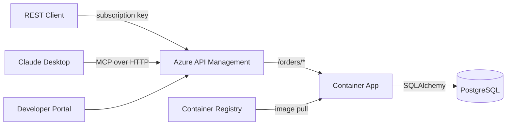

# CLAUDE.md — azure-apim-mcp-server

## Project Overview
ST Microelectronics semiconductor orders API deployed to Azure Container Apps, exposed through Azure API Management as both a REST API and MCP (Model Context Protocol) server, with Developer Portal.

## Architecture



## Tech Stack

| Component | Technology |
|-----------|-----------|
| API Framework | FastAPI (Python 3.11) |
| Database | PostgreSQL 16 (Azure Flexible Server in prod, Docker locally) |
| ORM | SQLAlchemy 2.0 (async) |
| Migrations | Alembic |
| MCP Server | Python `mcp` SDK (FastMCP) |
| Infrastructure | Azure Bicep |
| Hosting | Azure Container Apps |
| API Gateway | Azure API Management (Developer tier) |
| CI/CD | GitHub Actions |
| Container Registry | Azure Container Registry |
| Secrets | Azure Key Vault |

## Local Development

### Prerequisites
- Docker & Docker Compose
- Python 3.11+

### Quick Start
```bash
# Clone the repo
git clone https://github.com/ozgurkarahan/azure-apim-mcp-server.git
cd azure-apim-mcp-server

# Start services
docker-compose up --build

# API available at http://localhost:8000/docs
```

### Running Tests
```bash
pip install -r requirements-dev.txt
pytest tests/ -v
```

### Linting
```bash
ruff check src/ tests/
```

### Database Migrations
```bash
alembic upgrade head
alembic revision --autogenerate -m "description"
```

### MCP Server (Local/Standalone)
```bash
# Via stdio (for Claude Desktop / VS Code)
python -m src.mcp_server.server

# Set API_BASE_URL if the API runs on a different host
API_BASE_URL=http://localhost:8000 python -m src.mcp_server.server
```

## Code Conventions
- SQLAlchemy 2.0 style (mapped_column, Mapped types)
- UUIDs as primary keys for all tables
- Pydantic v2 model_config style (no class Config)
- All API routes under `/api/v1/`
- Health checks at `/health` and `/health/db`
- Order number format: `ST-ORD-YYYYMM-NNNN`
- Async SQLAlchemy sessions throughout
- Service layer pattern: routers -> services -> database

## Environment Variables
- `DATABASE_URL` — PostgreSQL connection string (uses `postgresql+asyncpg://` scheme)
- `ENVIRONMENT` — dev/staging/production
- `LOG_LEVEL` — logging level (default: info)
- `API_BASE_URL` — base URL for MCP server to reach the REST API (default: http://localhost:8000)

## API Reference

All endpoints are under `/api/v1/`.

| Method | Path | Description |
|--------|------|-------------|
| GET | `/health` | Health check |
| GET | `/health/db` | Database connectivity check |
| GET | `/api/v1/products` | List products (filter: category, family, search) |
| POST | `/api/v1/products` | Create product |
| GET | `/api/v1/products/{id}` | Get product |
| PUT | `/api/v1/products/{id}` | Update product |
| DELETE | `/api/v1/products/{id}` | Soft-delete product |
| GET | `/api/v1/customers` | List customers (filter: search, country) |
| POST | `/api/v1/customers` | Create customer |
| GET | `/api/v1/customers/{id}` | Get customer |
| PUT | `/api/v1/customers/{id}` | Update customer |
| GET | `/api/v1/orders` | List orders (filter: status, customer_id) |
| POST | `/api/v1/orders` | Create order (auto-calculates totals) |
| GET | `/api/v1/orders/{id}` | Get order with items |
| PUT | `/api/v1/orders/{id}` | Update order |
| DELETE | `/api/v1/orders/{id}` | Cancel order |

## Database Models

| Table | Key Fields | Relationships |
|-------|-----------|---------------|
| **customers** | id, company_name, contact_name, contact_email, phone, address, city, country | 1:N orders |
| **products** | id, part_number (unique), name, description, category, family, unit_price, currency, stock_quantity, lead_time_days, is_active | 1:N order_items |
| **orders** | id, order_number (unique), customer_id (FK), status (enum), total_amount, currency, shipping_address, notes, ordered_at, shipped_at, delivered_at | N:1 customer, 1:N items |
| **order_items** | id, order_id (FK), product_id (FK), quantity, unit_price, line_total | N:1 order, N:1 product |

**OrderStatus enum**: pending, confirmed, processing, shipped, delivered, cancelled

## Seed Data
- **28 products** across ST Micro families: STM32F4, STM32L4, STM32H7, STM32G0, STM32F1, STM32WB, STM8S (MCUs), LIS/LSM/LPS/HTS (MEMS sensors), STF/STD (power MOSFETs), L78/ST1S (power management), L6/L298 (motor drivers), BlueNRG (wireless), TSV/TSH (op-amps)
- **10 customers**: Fictional electronics companies across Germany, Japan, USA, South Korea, China, UK, France, Italy, Sweden, Canada
- **40 orders**: Distributed across statuses (~30% delivered, ~25% shipped, ~20% processing, ~15% confirmed, ~10% pending), 1-5 items each, spanning last 6 months

## Azure Deployment

### Deploy Infrastructure
```bash
az group create --name rg-apim-mcp-dev --location eastus
az deployment group create \
  --resource-group rg-apim-mcp-dev \
  --template-file infra/main.bicep \
  --parameters infra/main.bicepparam
```

> Note: APIM Developer tier takes ~30-40 min to provision on first deploy.

### Azure Resources (via Bicep)
1. **User-assigned Managed Identity** — used by Container App to pull from ACR
2. **Key Vault** — stores PostgreSQL admin password
3. **Azure Container Registry** (Basic SKU) — hosts Docker images
4. **PostgreSQL Flexible Server** (Burstable B1ms, v16, 32GB) + database `storders`
5. **Container Apps Environment + Container App** — runs FastAPI on port 8000, min 1 / max 3 replicas
6. **API Management** (Developer tier) — gateway for REST API + MCP

### CI/CD (GitHub Actions)
- **ci.yml**: Runs on PRs — lint with ruff, test with pytest
- **deploy.yml**: Runs on push to main — build/push Docker image, deploy Bicep infra, update Container App, import OpenAPI spec into APIM

### Required GitHub Secrets
- `AZURE_CREDENTIALS` — service principal JSON
- `AZURE_RESOURCE_GROUP` — resource group name
- `POSTGRES_ADMIN_PASSWORD` — PostgreSQL admin password
- `PUBLISHER_EMAIL` — APIM publisher email

## APIM Configuration
- API imported from Container App's `/openapi.json`
- **Product**: "ST Orders API - Free" (100 calls/min, self-service subscription)
- **Policies**: CORS (allow Developer Portal), rate limiting, backend URL routing
- REST API available at: `https://<apim>.azure-api.net/orders/api/v1/*`

## MCP Server

### A. APIM-native MCP (Primary) — Zero custom code
- APIM natively converts the imported REST API into an MCP server
- Endpoint: `https://<apim>.azure-api.net/st-orders-mcp/mcp`
- Transport: Streamable HTTP, auth via subscription key
- Configured via Azure Portal: APIM > APIs > MCP Servers > Create

### B. Standalone MCP Server (Secondary) — For local/direct use
- `src/mcp_server/server.py` using Python `mcp` SDK (FastMCP)
- Tools: list_products, get_product, list_customers, get_customer, list_orders, get_order, create_order, update_order_status
- Runs locally via stdio for Claude Desktop/VS Code

### Client Configuration (APIM)
```json
{
  "mcpServers": {
    "st-orders": {
      "type": "http",
      "url": "https://<apim>.azure-api.net/st-orders-mcp/mcp",
      "headers": {
        "Ocp-Apim-Subscription-Key": "<your-subscription-key>"
      }
    }
  }
}
```

### Client Configuration (Local Standalone)
```json
{
  "mcpServers": {
    "st-orders-local": {
      "command": "python",
      "args": ["-m", "src.mcp_server.server"],
      "cwd": "/path/to/azure-apim-mcp-server",
      "env": {
        "API_BASE_URL": "http://localhost:8000"
      }
    }
  }
}
```

## Project Structure
```
├── .github/workflows/    # CI (lint+test) and Deploy (build, infra, app, APIM)
├── infra/                # Azure Bicep templates (main + 7 modules)
├── src/app/              # FastAPI application
│   ├── main.py           # Entry point
│   ├── config.py         # pydantic-settings
│   ├── database.py       # SQLAlchemy engine/session
│   ├── models/           # customer, product, order, order_item
│   ├── schemas/          # Pydantic schemas per entity
│   ├── routers/          # health, customers, products, orders
│   ├── services/         # Business logic per entity
│   └── seed.py           # ST Micro themed seed data
├── src/mcp_server/       # Standalone MCP server (FastMCP)
├── alembic/              # Database migrations
├── tests/                # Pytest test suite
├── Dockerfile            # Multi-stage Python 3.11-slim
└── docker-compose.yml    # Local dev (PostgreSQL + app)
```
