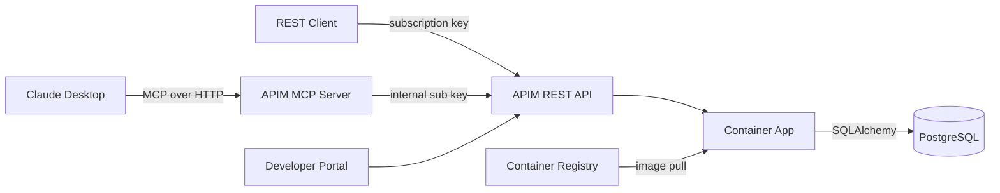

# CLAUDE.md — azure-apim-mcp-server

## Project Overview
Microelectronics semiconductor orders API deployed to Azure Container Apps, exposed through Azure API Management (StandardV2) as both a REST API and MCP (Model Context Protocol) server, linked to AI Foundry as an AI Gateway.

## Architecture



### Request Flows

**REST API flow**: Client → APIM REST API (`/orders/api/v1/*`, subscription key + CORS) → Container App (FastAPI) → PostgreSQL

**MCP flow**: Claude Desktop → APIM MCP Server (`/st-orders-mcp/mcp`, subscription key, Streamable HTTP) → APIM translates JSON-RPC tool calls into REST API operations → routes to APIM REST API (internal subscription key + CORS) → Container App (FastAPI) → PostgreSQL → response flows back as JSON-RPC result

**Key points**:
- The MCP flow is handled entirely by APIM's native MCP gateway — no custom MCP code runs on the Container App
- MCP tool calls route **through the APIM REST API** (not directly to the Container App), so all REST API policies (CORS, rate limiting) are applied consistently in one place
- The MCP API's `serviceUrl` points to the APIM REST API endpoint (`/orders`), and an internal subscription key (stored as a named value) is injected via `set-header` policy
- Easy Auth on Container App is **disabled** — access control is handled at the APIM layer via subscription keys

## Tech Stack

| Component | Technology |
|-----------|-----------|
| API Framework | FastAPI (Python 3.11) |
| Database | PostgreSQL 16 (Azure Flexible Server in prod, Docker locally) |
| ORM | SQLAlchemy 2.0 (async) |
| Migrations | Alembic |
| MCP Server (APIM) | APIM native MCP gateway (`apiType: 'mcp'`) — zero custom code |
| MCP Server (local) | Python `mcp` SDK (FastMCP) — for stdio/local dev |
| Infrastructure | Azure Bicep |
| Hosting | Azure Container Apps |
| API Gateway | Azure API Management (StandardV2 tier) |
| Auth | APIM subscription keys (Easy Auth disabled) |
| CI/CD | GitHub Actions |
| Container Registry | Azure Container Registry |
| Secrets | Azure Key Vault |

## Local Development

### Prerequisites
- Docker & Docker Compose
- Python 3.11+

### Quick Start
```bash
# Clone the repo
git clone https://github.com/ozgurkarahan/azure-apim-mcp-server.git
cd azure-apim-mcp-server

# Start services
docker-compose up --build

# API available at http://localhost:8000/docs
```

### Running Tests
```bash
pip install -r requirements-dev.txt
pytest tests/ -v
```

### Linting
```bash
ruff check src/ tests/
```

### Database Migrations
```bash
alembic upgrade head
alembic revision --autogenerate -m "description"
```

### MCP Server (Local/Standalone)
```bash
# Via stdio (for Claude Desktop / VS Code)
python -m src.mcp_server.server

# Set API_BASE_URL if the API runs on a different host
API_BASE_URL=http://localhost:8000 python -m src.mcp_server.server
```

## Code Conventions
- SQLAlchemy 2.0 style (mapped_column, Mapped types)
- UUIDs as primary keys for all tables
- Pydantic v2 model_config style (no class Config)
- All API routes under `/api/v1/`
- Health checks at `/health` and `/health/db`
- Order number format: `ST-ORD-YYYYMM-NNNN`
- Async SQLAlchemy sessions throughout
- Service layer pattern: routers -> services -> database

## Environment Variables
- `DATABASE_URL` — PostgreSQL connection string (uses `postgresql+asyncpg://` scheme). **Password must not contain `@`** — it breaks URL parsing (the `@` is interpreted as the user:password@host separator).
- `ENVIRONMENT` — dev/staging/production
- `LOG_LEVEL` — logging level (default: info)
- `API_BASE_URL` — base URL for MCP server to reach the REST API (default: http://localhost:8000)

## API Reference

All endpoints are under `/api/v1/`.

| Method | Path | Description |
|--------|------|-------------|
| GET | `/health` | Health check |
| GET | `/health/db` | Database connectivity check |
| GET | `/api/v1/products` | List products (filter: category, family, search) |
| POST | `/api/v1/products` | Create product |
| GET | `/api/v1/products/{id}` | Get product |
| PUT | `/api/v1/products/{id}` | Update product |
| DELETE | `/api/v1/products/{id}` | Soft-delete product |
| GET | `/api/v1/customers` | List customers (filter: search, country) |
| POST | `/api/v1/customers` | Create customer |
| GET | `/api/v1/customers/{id}` | Get customer |
| PUT | `/api/v1/customers/{id}` | Update customer |
| GET | `/api/v1/orders` | List orders (filter: status, customer_id) |
| POST | `/api/v1/orders` | Create order (auto-calculates totals) |
| GET | `/api/v1/orders/{id}` | Get order with items |
| PUT | `/api/v1/orders/{id}` | Update order |
| DELETE | `/api/v1/orders/{id}` | Cancel order |

## Database Models

| Table | Key Fields | Relationships |
|-------|-----------|---------------|
| **customers** | id, company_name, contact_name, contact_email, phone, address, city, country | 1:N orders |
| **products** | id, part_number (unique), name, description, category, family, unit_price, currency, stock_quantity, lead_time_days, is_active | 1:N order_items |
| **orders** | id, order_number (unique), customer_id (FK), status (enum), total_amount, currency, shipping_address, notes, ordered_at, shipped_at, delivered_at | N:1 customer, 1:N items |
| **order_items** | id, order_id (FK), product_id (FK), quantity, unit_price, line_total | N:1 order, N:1 product |

**OrderStatus enum**: pending, confirmed, processing, shipped, delivered, cancelled

## Seed Data
- **28 products** across Microelectronics families: STM32F4, STM32L4, STM32H7, STM32G0, STM32F1, STM32WB, STM8S (MCUs), LIS/LSM/LPS/HTS (MEMS sensors), STF/STD (power MOSFETs), L78/ST1S (power management), L6/L298 (motor drivers), BlueNRG (wireless), TSV/TSH (op-amps)
- **10 customers**: Fictional electronics companies across Germany, Japan, USA, South Korea, China, UK, France, Italy, Sweden, Canada
- **40 orders**: Distributed across statuses (~30% delivered, ~25% shipped, ~20% processing, ~15% confirmed, ~10% pending), 1-5 items each, spanning last 6 months

## Azure Deployment

### Deploy Infrastructure
```bash
az group create --name rg-poc-apim --location swedencentral
az deployment group create \
  --resource-group rg-poc-apim \
  --template-file infra/main.bicep \
  --parameters environmentName=apim-mcp-dev \
    publisherEmail=<email> \
    postgresAdminPassword=<password-without-@> \
    authClientId=<app-registration-client-id> \
    containerImage=<acr>.azurecr.io/st-orders-api:latest
```

> Note: APIM StandardV2 takes ~5 min to provision (much faster than the old Developer tier). Container App depends on APIM (needs its `principalId` for Easy Auth), so they deploy sequentially.

### Azure Resources (via Bicep)
1. **User-assigned Managed Identity** — used by Container App to pull from ACR
2. **Key Vault** — stores PostgreSQL admin password
3. **Azure Container Registry** (Basic SKU) — hosts Docker images
4. **PostgreSQL Flexible Server** (Burstable B1ms, v16, 32GB) + database `storders`
5. **Container Apps Environment + Container App** — runs FastAPI on port 8000, min 1 / max 3 replicas
6. **API Management** (StandardV2 tier, system-assigned MI) — gateway for REST API + MCP, linked to AI Foundry as AI Gateway
7. **APIM REST API** (`st-orders-api`) — imported from OpenAPI spec, exposes `/orders/api/v1/*`
8. **APIM MCP API** (`st-orders-mcp`, `apiType: 'mcp'`) — exposes 8 REST operations as MCP tools at `/st-orders-mcp/mcp`, routes tool calls through the APIM REST API (not directly to backend)
9. **Easy Auth** (Container App authConfig) — **disabled**; config retained for optional re-enablement with v2 token issuer

### Bicep Module Dependency Graph
```
identity ──┬── keyvault
            ├── acr ──────────┐
            │                  ▼
apim ──────┬── containerApp (depends on: identity, acr, postgres, apim)
            │       │
            │       ▼
            ├── apimApi (depends on: apim, containerApp)
            │       │
            │       ▼
            ├── apimMcp (depends on: apim, apimApi)
            │
            └── apimFoundryRoles (depends on: apim; conditional on aiFoundryPrincipalId)

postgres ──────────┘
```

### CI/CD (GitHub Actions)
- **ci.yml**: Runs on PRs — lint with ruff, test with pytest
- **deploy.yml**: Runs on push to main — build/push Docker image, deploy Bicep infra, update Container App, import OpenAPI spec into APIM

### Required GitHub Secrets
- `AZURE_CREDENTIALS` — service principal JSON
- `AZURE_RESOURCE_GROUP` — resource group name
- `POSTGRES_ADMIN_PASSWORD` — PostgreSQL admin password
- `PUBLISHER_EMAIL` — APIM publisher email
- `AUTH_CLIENT_ID` — Entra ID App Registration client ID for Easy Auth
- `AI_FOUNDRY_PRINCIPAL_ID` — Principal ID of the AI Foundry hub managed identity (for APIM role assignment)

## APIM Configuration
- API imported from Container App's `/openapi.json`
- **Product**: "ST Orders API - Free" (100 calls/min, self-service subscription)
- **REST API policies**: CORS (allow Developer Portal), rate limiting
- **MCP API policy**: `set-header` injects internal subscription key to route calls through the REST API
- **Named value**: `st-orders-internal-key` — subscription key used by MCP API to call the REST API internally
- REST API available at: `https://<apim>.azure-api.net/orders/api/v1/*`
- MCP API available at: `https://<apim>.azure-api.net/st-orders-mcp/mcp` (serviceUrl → `/orders`)

## AI Foundry Integration (AI Gateway)

The APIM instance (StandardV2) is linked to AI Foundry as an **AI Gateway**, enabling token limits, quotas, agent governance, and a unified control plane for API/model calls.

### Requirements
- APIM must be **StandardV2** (v2 architecture) — classic tiers (Developer, Basic, Standard) are not compatible
- The AI Foundry hub's managed identity needs **API Management Service Contributor** role on the APIM instance (deployed via `apim-foundry-roles.bicep`)

### Resources
| Item | Value |
|------|-------|
| AI Foundry hub | `aoai-c544zegk5tvc2` in `rg-ai-search-agent` |
| Foundry project | `proj-c544zegk5tvc2` |
| Foundry MI principal ID | `16f8dbdc-61c3-42ff-a3c7-8692833c692e` |

### Linking APIM to AI Foundry (Portal — one-time manual step)
AI Gateway linking cannot be done via CLI or Bicep. After deployment:
1. Go to [Microsoft Foundry portal](https://ai.azure.com)
2. Select **Operate** > **Admin console** > **AI Gateway** tab
3. **Add AI Gateway** > select Foundry resource `aoai-c544zegk5tvc2`
4. Choose **Use existing** APIM > select `apim-mcp-dev-apim`
5. Name the gateway (e.g., `st-orders-gateway`) > **Add**
6. Enable project: select the gateway > **Add project to gateway** > select `proj-c544zegk5tvc2`

### SKU Migration Note
Classic Developer tier cannot be upgraded in-place to StandardV2. To migrate:
```bash
az apim delete --name apim-mcp-dev-apim --resource-group rg-poc-apim --yes
az apim deletedservice purge --service-name apim-mcp-dev-apim --location swedencentral
# Then redeploy via Bicep — StandardV2 provisions in ~5 min
```

## Authentication

Access control is handled at the APIM layer via **subscription keys**. Easy Auth on the Container App is **disabled**.

**REST API flow**: Client → APIM REST API (subscription key required) → Container App (no auth) → Backend

**MCP flow**: Client → APIM MCP Server (subscription key) → APIM REST API (internal subscription key via `set-header`) → Container App → Backend

### Easy Auth (Disabled)

Easy Auth (`Microsoft.App/containerApps/authConfigs`) is deployed but disabled (`platform.enabled: false`). The auth config is retained in Bicep so it can be re-enabled if needed.

If re-enabling Easy Auth, note these key findings from the StandardV2 migration:

**StandardV2 APIM issues v2 tokens**: Unlike the classic Developer tier (which issued v1 tokens via IMDS), the StandardV2 APIM managed identity issues **v2 tokens**. The v2 token has `iss: "https://login.microsoftonline.com/{tenantId}/v2.0"` and `ver: "2.0"`. The Easy Auth `openIdIssuer` in Bicep is already set to the v2 format to match.

**allowedPrincipals, not allowedApplications**: Easy Auth's `defaultAuthorizationPolicy.allowedApplications: []` means "deny all callers" (not "allow all"). Use `allowedPrincipals.identities` with the APIM MI's `principalId` (checks the `oid` claim).

**Dual audiences**: The `allowedAudiences` list includes both `api://<clientId>` (Application ID URI) and the raw `<clientId>` to accept tokens regardless of which audience format was requested.

### App Registration (CLI — not possible in Bicep)

An App Registration exists for this project (client ID: `authClientId` parameter). It was created for Easy Auth and may be needed if re-enabling:

```bash
az ad app create --display-name "st-orders-api" --sign-in-audience AzureADMyOrg
az ad app update --id <appId> --identifier-uris "api://<appId>"
az ad sp create --id <appId>
```

### To Re-enable Easy Auth
1. In `container-app.bicep`: set `platform.enabled: true`
2. In `apim-api.bicep`: add `<authentication-managed-identity resource="api://<authClientId>" />` to the inbound policy
3. In `main.bicep`: pass `authAudience: 'api://${authClientId}'` to apimApi module
4. Redeploy — APIM MI will acquire v2 tokens and Easy Auth will validate them

## MCP Server

### A. APIM-native MCP (Primary) — Zero custom code
- APIM natively converts the imported REST API into an MCP server
- Endpoint: `https://<apim>.azure-api.net/st-orders-mcp/mcp`
- Transport: Streamable HTTP (JSON-RPC 2.0 over SSE), auth via subscription key
- Deployed via Bicep: `infra/modules/apim-mcp.bicep` (uses `apiType: 'mcp'` + `type: 'mcp'` with API version `2025-03-01-preview`)
- **Routes through APIM REST API**: `serviceUrl` points to the APIM REST API endpoint (`/orders`), not directly to the Container App. Internal subscription key injected via `set-header` policy and stored as named value `st-orders-internal-key`.
- 8 MCP tools mapped to REST API operations: list_products, get_product, list_customers, get_customer, list_orders, get_order, create_order, update_order_status
- Linked to the `st-orders-free` product — same subscription key works for both REST and MCP
- Tool names match the FastAPI-generated operationIds (e.g., `list_products_api_v1_products_get`)

#### How APIM-native MCP works
1. MCP client sends JSON-RPC request (e.g., `tools/call` with `name: "list_products_api_v1_products_get"`)
2. APIM MCP gateway matches the tool name to the corresponding REST API operation in `st-orders-api`
3. APIM translates the tool arguments into a REST request (query params, path params, body)
4. APIM MCP inbound policy injects the internal subscription key via `set-header`
5. APIM sends the REST request to the APIM REST API endpoint (`/orders/api/v1/...`)
6. APIM REST API applies CORS + rate limiting, then forwards to the Container App backend
7. Response flows back: Container App → REST API → MCP gateway → JSON-RPC result streamed via SSE

#### Bicep schema notes
- MCP API and policy use API version `2025-03-01-preview` (preview); all other child resources use `2024-05-01` (required for StandardV2 compatibility)
- Must set **both** `apiType: 'mcp'` and `type: 'mcp'` in properties
- `mcpTools` array uses `name` (operation name) + `operationId` (full ARM resource ID)
- Bicep shows `BCP037` warnings for MCP properties — these are expected and can be ignored
- Subscription key for internal routing is read via `listSecrets()` on the existing subscription and stored as a secret named value

### B. Standalone MCP Server (Secondary) — For local/direct use
- `src/mcp_server/server.py` using Python `mcp` SDK (FastMCP)
- Tools: list_products, get_product, list_customers, get_customer, list_orders, get_order, create_order, update_order_status
- Runs locally via stdio for Claude Desktop/VS Code

### Client Configuration (APIM)
```json
{
  "mcpServers": {
    "st-orders": {
      "type": "http",
      "url": "https://<apim>.azure-api.net/st-orders-mcp/mcp",
      "headers": {
        "Ocp-Apim-Subscription-Key": "<your-subscription-key>"
      }
    }
  }
}
```

### Client Configuration (Local Standalone)
```json
{
  "mcpServers": {
    "st-orders-local": {
      "command": "python",
      "args": ["-m", "src.mcp_server.server"],
      "cwd": "/path/to/azure-apim-mcp-server",
      "env": {
        "API_BASE_URL": "http://localhost:8000"
      }
    }
  }
}
```

### Testing MCP Endpoint
```bash
# Initialize session
curl -X POST "https://<apim>.azure-api.net/st-orders-mcp/mcp" \
  -H "Ocp-Apim-Subscription-Key: <key>" \
  -H "Content-Type: application/json" \
  -H "Accept: application/json, text/event-stream" \
  -d '{"jsonrpc":"2.0","method":"initialize","id":1,"params":{"protocolVersion":"2025-03-26","capabilities":{},"clientInfo":{"name":"test","version":"1.0"}}}'

# List available tools
curl -X POST ... -d '{"jsonrpc":"2.0","method":"tools/list","id":2}'

# Call a tool
curl -X POST ... -d '{"jsonrpc":"2.0","method":"tools/call","id":3,"params":{"name":"list_products_api_v1_products_get","arguments":{"category":"Microcontrollers","limit":"2"}}}'
```

## Project Structure
```
├── .github/workflows/    # CI (lint+test) and Deploy (build, infra, app, APIM)
├── infra/                # Azure Bicep templates (main + 9 modules)
│   ├── main.bicep        # Orchestrator
│   └── modules/
│       ├── managed-identity.bicep
│       ├── keyvault.bicep
│       ├── acr.bicep
│       ├── postgresql.bicep
│       ├── container-app.bicep
│       ├── apim.bicep
│       ├── apim-api.bicep      # REST API import + product + subscription
│       ├── apim-mcp.bicep       # MCP server (routes through REST API)
│       └── apim-foundry-roles.bicep  # AI Foundry role assignments (conditional)
├── src/app/              # FastAPI application
│   ├── main.py           # Entry point
│   ├── config.py         # pydantic-settings
│   ├── database.py       # SQLAlchemy engine/session
│   ├── models/           # customer, product, order, order_item
│   ├── schemas/          # Pydantic schemas per entity
│   ├── routers/          # health, customers, products, orders
│   ├── services/         # Business logic per entity
│   └── seed.py           # Microelectronics themed seed data
├── src/mcp_server/       # Standalone MCP server (FastMCP)
├── alembic/              # Database migrations
├── tests/                # Pytest test suite
├── Dockerfile            # Multi-stage Python 3.11-slim
└── docker-compose.yml    # Local dev (PostgreSQL + app)
```
