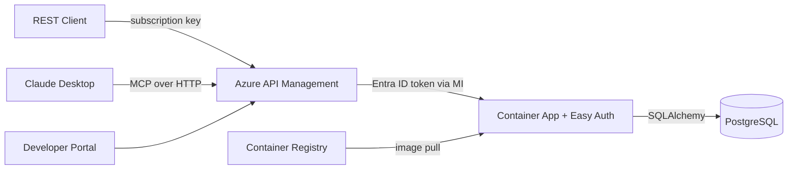

# Azure APIM MCP Server — Microelectronics Semiconductor Orders API

A semiconductor orders API built with Python/FastAPI and PostgreSQL, deployed to Azure Container Apps, and exposed through Azure API Management as both a REST API and MCP (Model Context Protocol) server.

## Architecture



### How It Works

**REST API**: Clients call APIM with a subscription key at `/orders/api/v1/*`. APIM authenticates to the Container App using a managed identity (Entra ID token), then forwards the request.

**MCP Server**: AI assistants (Claude Desktop, VS Code, etc.) connect to APIM at `/st-orders-mcp/mcp` using Streamable HTTP transport. APIM natively translates MCP tool calls (JSON-RPC) into REST API operations — no custom MCP code needed. The same Entra ID authentication flow protects the backend.

## Tech Stack

| Component | Technology |
|-----------|-----------|
| API Framework | FastAPI (Python 3.11) |
| Database | PostgreSQL 16 |
| ORM | SQLAlchemy 2.0 (async) |
| Migrations | Alembic |
| MCP Server | APIM native MCP gateway (primary) / Python FastMCP (local) |
| Infrastructure | Azure Bicep |
| Hosting | Azure Container Apps |
| API Gateway | Azure API Management (Developer tier) |
| Auth | Microsoft Entra ID (Easy Auth + Managed Identity) |
| CI/CD | GitHub Actions |
| Container Registry | Azure Container Registry |

## Local Development

### Prerequisites
- Docker & Docker Compose
- Python 3.11+

### Quick Start

```bash
# Clone the repo
git clone https://github.com/ozgurkarahan/azure-apim-mcp-server.git
cd azure-apim-mcp-server

# Start with Docker Compose
docker-compose up --build

# API docs available at http://localhost:8000/docs
```

### Running Tests

```bash
pip install -r requirements-dev.txt
pytest tests/ -v
```

### Linting

```bash
ruff check src/ tests/
```

## API Reference

All endpoints are under `/api/v1/`.

| Method | Path | Description |
|--------|------|-------------|
| GET | `/health` | Health check |
| GET | `/health/db` | Database connectivity |
| GET/POST | `/api/v1/products` | List / Create products |
| GET/PUT/DELETE | `/api/v1/products/{id}` | Get / Update / Soft-delete product |
| GET/POST | `/api/v1/customers` | List / Create customers |
| GET/PUT | `/api/v1/customers/{id}` | Get / Update customer |
| GET/POST | `/api/v1/orders` | List / Create orders |
| GET/PUT/DELETE | `/api/v1/orders/{id}` | Get / Update / Cancel order |

## MCP Server

### APIM-native MCP (Primary)

APIM exposes 8 REST API operations as MCP tools at `/st-orders-mcp/mcp`. Deployed via Bicep (`infra/modules/apim-mcp.bicep`), no custom code required.

**Tools**: list_products, get_product, list_customers, get_customer, list_orders, get_order, create_order, update_order_status

**Claude Desktop config**:
```json
{
  "mcpServers": {
    "st-orders": {
      "type": "http",
      "url": "https://<apim-name>.azure-api.net/st-orders-mcp/mcp",
      "headers": {
        "Ocp-Apim-Subscription-Key": "<your-subscription-key>"
      }
    }
  }
}
```

### Standalone MCP Server (Local)

For local development via stdio:
```json
{
  "mcpServers": {
    "st-orders-local": {
      "command": "python",
      "args": ["-m", "src.mcp_server.server"],
      "cwd": "/path/to/azure-apim-mcp-server",
      "env": {
        "API_BASE_URL": "http://localhost:8000"
      }
    }
  }
}
```

## Azure Deployment

### Deploy Infrastructure

```bash
az group create --name rg-poc-apim --location swedencentral
az deployment group create \
  --resource-group rg-poc-apim \
  --template-file infra/main.bicep \
  --parameters environmentName=apim-mcp-dev \
    publisherEmail=<email> \
    postgresAdminPassword=<password-without-@> \
    authClientId=<app-registration-client-id> \
    containerImage=<acr>.azurecr.io/st-orders-api:latest
```

### Azure Resources (via Bicep)
1. User-assigned Managed Identity
2. Key Vault
3. Azure Container Registry (Basic)
4. PostgreSQL Flexible Server (B1ms, v16)
5. Container Apps Environment + Container App
6. API Management (Developer tier, system-assigned MI)
7. APIM REST API (imported from OpenAPI)
8. APIM MCP API (`apiType: 'mcp'`, 8 tools)
9. Easy Auth (Entra ID token validation)

## Project Structure

```
├── .github/workflows/    # CI/CD pipelines
├── infra/                # Azure Bicep templates (main + 8 modules)
│   ├── main.bicep
│   └── modules/
│       ├── managed-identity.bicep
│       ├── keyvault.bicep
│       ├── acr.bicep
│       ├── postgresql.bicep
│       ├── container-app.bicep
│       ├── apim.bicep
│       ├── apim-api.bicep      # REST API + product + subscription
│       └── apim-mcp.bicep      # MCP server (apiType: 'mcp')
├── src/app/              # FastAPI application
├── src/mcp_server/       # Standalone MCP server (FastMCP)
├── alembic/              # Database migrations
├── tests/                # Test suite
├── Dockerfile
└── docker-compose.yml
```

## License

MIT
