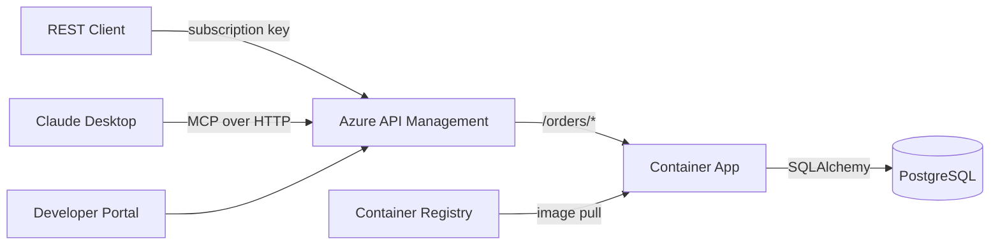

# Azure APIM MCP Server — ST Micro Semiconductor Orders API

A semiconductor orders API for ST Microelectronics, built with Python/FastAPI and PostgreSQL, deployed to Azure Container Apps, and exposed through Azure API Management as both a REST API and MCP (Model Context Protocol) server.

## Architecture



## Tech Stack

| Component | Technology |
|-----------|-----------|
| API Framework | FastAPI (Python 3.11) |
| Database | PostgreSQL 16 |
| ORM | SQLAlchemy 2.0 (async) |
| Migrations | Alembic |
| MCP Server | Python `mcp` SDK (FastMCP) |
| Infrastructure | Azure Bicep |
| Hosting | Azure Container Apps |
| API Gateway | Azure API Management (Developer tier) |
| CI/CD | GitHub Actions |
| Container Registry | Azure Container Registry |

## Local Development

### Prerequisites
- Docker & Docker Compose
- Python 3.11+

### Quick Start

```bash
# Clone the repo
git clone https://github.com/ozgurkarahan/azure-apim-mcp-server.git
cd azure-apim-mcp-server

# Start with Docker Compose
docker-compose up --build

# API docs available at http://localhost:8000/docs
```

### Running Tests

```bash
pip install -r requirements-dev.txt
pytest tests/ -v
```

### Linting

```bash
ruff check src/ tests/
```

## API Reference

All endpoints are under `/api/v1/`.

| Method | Path | Description |
|--------|------|-------------|
| GET | `/health` | Health check |
| GET | `/health/db` | Database connectivity |
| GET/POST | `/api/v1/products` | List / Create products |
| GET/PUT/DELETE | `/api/v1/products/{id}` | Get / Update / Soft-delete product |
| GET/POST | `/api/v1/customers` | List / Create customers |
| GET/PUT | `/api/v1/customers/{id}` | Get / Update customer |
| GET/POST | `/api/v1/orders` | List / Create orders |
| GET/PUT/DELETE | `/api/v1/orders/{id}` | Get / Update / Cancel order |

## Azure Deployment

### Deploy Infrastructure

```bash
az group create --name rg-apim-mcp-dev --location eastus
az deployment group create \
  --resource-group rg-apim-mcp-dev \
  --template-file infra/main.bicep \
  --parameters infra/main.bicepparam
```

### MCP Server Configuration

Connect Claude Desktop to the APIM-hosted MCP endpoint:

```json
{
  "mcpServers": {
    "st-orders": {
      "type": "http",
      "url": "https://<apim-name>.azure-api.net/st-orders-mcp/mcp",
      "headers": {
        "Ocp-Apim-Subscription-Key": "<your-subscription-key>"
      }
    }
  }
}
```

## Project Structure

```
├── .github/workflows/    # CI/CD pipelines
├── infra/                # Azure Bicep templates
├── src/app/              # FastAPI application
├── src/mcp_server/       # Standalone MCP server
├── alembic/              # Database migrations
├── tests/                # Test suite
├── Dockerfile
└── docker-compose.yml
```

## License

MIT
