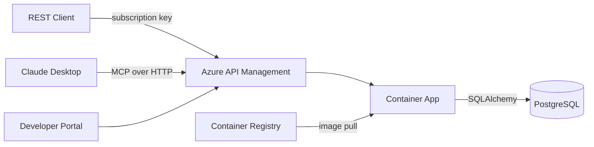

# Azure APIM MCP Server — Microelectronics Semiconductor Orders API

A semiconductor orders API built with Python/FastAPI and PostgreSQL, deployed to Azure Container Apps, and exposed through Azure API Management as both a REST API and MCP (Model Context Protocol) server.

## Architecture


```mermaid
graph LR
    Client[REST Client] -->|subscription key| APIM[Azure API Management]
    Claude[Claude Desktop] -->|MCP over HTTP| APIM
    APIM --> CA[Container App]
    CA -->|SQLAlchemy| PG[(PostgreSQL)]
    DevPortal[Developer Portal] --> APIM
    ACR[Container Registry] -->|image pull| CA
```

### How It Works

**REST API**: Clients call APIM with a subscription key at `/orders/api/v1/*`. APIM forwards the request to the Container App backend.

**MCP Server**: AI assistants (Claude Desktop, VS Code, etc.) connect to APIM at `/st-orders-mcp/mcp` using Streamable HTTP transport. APIM natively translates MCP tool calls (JSON-RPC) into REST API operations — no custom MCP code needed. MCP tool calls route through the APIM REST API (not directly to the backend), with an internal subscription key injected via policy.

## Tech Stack

| Component | Technology |
|-----------|-----------|
| API Framework | FastAPI (Python 3.11) |
| Database | PostgreSQL 16 |
| ORM | SQLAlchemy 2.0 (async) |
| Migrations | Alembic |
| MCP Server | APIM native MCP gateway |
| Infrastructure | Azure Bicep |
| Hosting | Azure Container Apps |
| API Gateway | Azure API Management (StandardV2 tier) |
| Auth | APIM subscription keys |
| CI/CD | GitHub Actions |
| Container Registry | Azure Container Registry |

## Local Development

### Prerequisites
- Docker & Docker Compose
- Python 3.11+

### Quick Start

```bash
# Clone the repo
git clone https://github.com/ozgurkarahan/azure-apim-mcp-server.git
cd azure-apim-mcp-server

# Start with Docker Compose
docker-compose up --build

# API docs available at http://localhost:8000/docs
```

### Running Tests

```bash
pip install -r requirements-dev.txt
pytest tests/ -v
```

### Linting

```bash
ruff check src/ tests/
```

## API Reference

All endpoints are under `/api/v1/`.

| Method | Path | Description |
|--------|------|-------------|
| GET | `/health` | Health check |
| GET | `/health/db` | Database connectivity |
| GET/POST | `/api/v1/products` | List / Create products |
| GET/PUT/DELETE | `/api/v1/products/{id}` | Get / Update / Soft-delete product |
| GET/POST | `/api/v1/customers` | List / Create customers |
| GET/PUT | `/api/v1/customers/{id}` | Get / Update customer |
| GET/POST | `/api/v1/orders` | List / Create orders |
| GET/PUT/DELETE | `/api/v1/orders/{id}` | Get / Update / Cancel order |

## MCP Server

### APIM-native MCP

APIM exposes 8 REST API operations as MCP tools at `/st-orders-mcp/mcp`. Deployed via Bicep (`infra/modules/apim-mcp.bicep`), no custom code required.

**Tools**: list_products, get_product, list_customers, get_customer, list_orders, get_order, create_order, update_order_status

**Claude Desktop config**:
```json
{
  "mcpServers": {
    "st-orders": {
      "type": "http",
      "url": "https://<apim-name>.azure-api.net/st-orders-mcp/mcp",
      "headers": {
        "Ocp-Apim-Subscription-Key": "<your-subscription-key>"
      }
    }
  }
}
```

## Azure Deployment

### Prerequisites

- [Azure CLI](https://learn.microsoft.com/cli/azure/install-azure-cli)
- [Azure Developer CLI (`azd`)](https://learn.microsoft.com/azure/developer/azure-developer-cli/install-azd)
- A resource group (e.g., `az group create --name rg-poc-apim --location swedencentral`)

### Quick Deploy with `azd`

This is the primary deployment method. `azd` handles infrastructure provisioning, app deployment, and post-deploy configuration in a single command.

```bash
# Initialize the azd environment
azd init -e dev

# Set required parameters
azd env set PUBLISHER_EMAIL <your-email>
azd env set POSTGRES_ADMIN_PASSWORD <password-without-@>

# Optional parameters
azd env set AUTH_CLIENT_ID <app-registration-client-id>
azd env set AI_FOUNDRY_PRINCIPAL_ID <principal-id>

# Deploy everything
azd up
```

**Environment variables** (read by `infra/main.bicepparam`):

| Variable | Required | Description |
|----------|----------|-------------|
| `PUBLISHER_EMAIL` | Yes | Email address for the APIM publisher |
| `POSTGRES_ADMIN_PASSWORD` | Yes | PostgreSQL admin password (**must not contain `@`** — breaks asyncpg URL parsing) |
| `AUTH_CLIENT_ID` | No | Entra ID App Registration client ID (only if enabling Easy Auth) |
| `AI_FOUNDRY_PRINCIPAL_ID` | No | AI Foundry hub managed identity principal ID for APIM role assignment |

**How it works:**
1. **Phase 1** — `azd up` provisions infrastructure (ACR, APIM, PostgreSQL, Container App with placeholder image) and builds/deploys the app container
2. **Phase 2** — The `postdeploy` hook (`hooks/postdeploy.sh` / `postdeploy.ps1`) automatically runs after deploy: waits for the app health check, then re-runs the Bicep deployment with `DEPLOY_API_CONFIG=true` to import the OpenAPI spec and configure MCP

This means a single `azd up` handles the entire deployment — no manual two-phase steps needed.

> **Note:** APIM StandardV2 takes ~5 minutes to provision on the first deployment.

### GitHub Actions (CI/CD)

The GitHub Actions workflow (`.github/workflows/deploy.yml`) runs on push to `main` and automates the same two-phase flow:

1. **deploy-infrastructure** — Phase 1 Bicep deployment (base infrastructure)
2. **build-and-push** — Build Docker image, push to ACR
3. **deploy-app** — Update Container App with the new image
4. **configure-apim** — Health check + Phase 2 Bicep deployment (API import + MCP config)

**Required GitHub secrets:**

| Secret | Required | Description |
|--------|----------|-------------|
| `AZURE_CREDENTIALS` | Yes | Service principal JSON from `az ad sp create-for-rbac` |
| `AZURE_RESOURCE_GROUP` | Yes | Resource group name (e.g., `rg-poc-apim`) |
| `POSTGRES_ADMIN_PASSWORD` | Yes | PostgreSQL admin password (**must not contain `@`**) |
| `PUBLISHER_EMAIL` | Yes | Email address for the APIM publisher |
| `AUTH_CLIENT_ID` | No | Entra ID App Registration client ID |
| `AI_FOUNDRY_PRINCIPAL_ID` | No | AI Foundry hub managed identity principal ID |

**Service Principal setup** (needed for GitHub Actions):

```bash
# Create SP with Contributor role
az ad sp create-for-rbac --name "github-deploy-sp" --role Contributor \
  --scopes /subscriptions/<subscription-id>/resourceGroups/rg-poc-apim

# The SP also needs User Access Administrator for Bicep role assignments
SP_OBJECT_ID=$(az ad sp list --display-name "github-deploy-sp" --query "[0].id" -o tsv)
az role assignment create --assignee $SP_OBJECT_ID \
  --role "User Access Administrator" \
  --scope /subscriptions/<subscription-id>/resourceGroups/rg-poc-apim
```

### Azure Resources (via Bicep)
1. User-assigned Managed Identity
2. Key Vault
3. Azure Container Registry (Basic)
4. PostgreSQL Flexible Server (B1ms, v16)
5. Container Apps Environment + Container App
6. API Management (StandardV2 tier, system-assigned MI)
7. APIM REST API (imported from OpenAPI)
8. APIM MCP API (`apiType: 'mcp'`, 8 tools)

## Project Structure

```
├── .github/workflows/    # CI/CD pipelines
├── hooks/                # azd lifecycle hooks
│   ├── postdeploy.sh     # Phase 2 Bicep deployment (Linux/macOS)
│   └── postdeploy.ps1   # Phase 2 Bicep deployment (Windows)
├── infra/                # Azure Bicep templates (main + 8 modules)
│   ├── main.bicep
│   ├── main.bicepparam   # Parameters (reads env vars from azd)
│   └── modules/
│       ├── managed-identity.bicep
│       ├── keyvault.bicep
│       ├── acr.bicep
│       ├── postgresql.bicep
│       ├── container-app.bicep
│       ├── apim.bicep
│       ├── apim-api.bicep      # REST API + product + subscription
│       └── apim-mcp.bicep      # MCP server (apiType: 'mcp')
├── src/app/              # FastAPI application
├── alembic/              # Database migrations
├── tests/                # Test suite
├── azure.yaml            # Azure Developer CLI project config
├── Dockerfile
└── docker-compose.yml
```

## License

MIT
