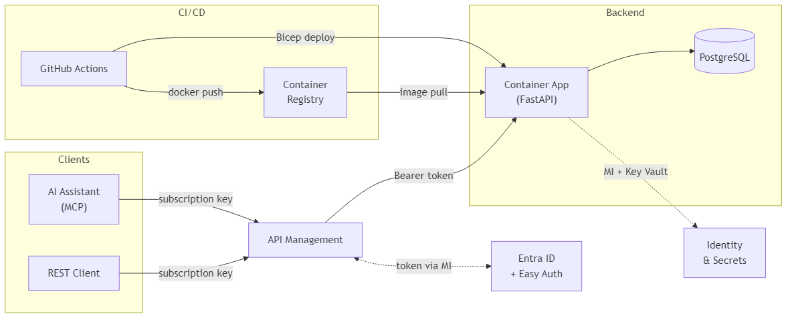
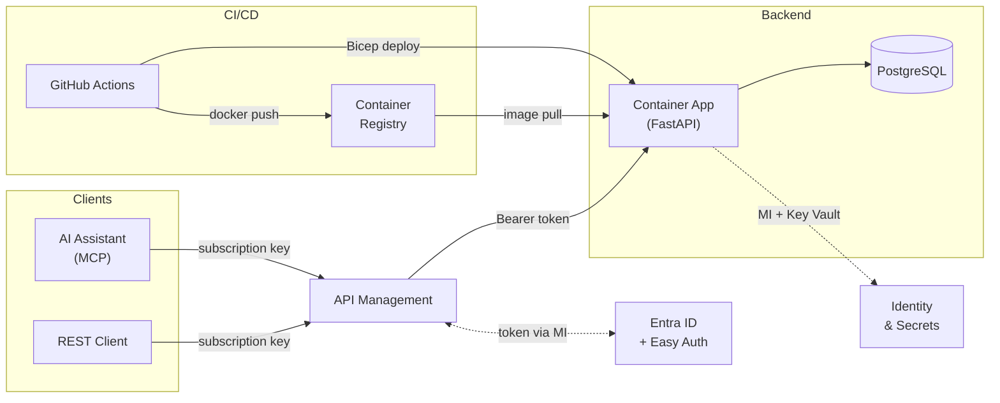
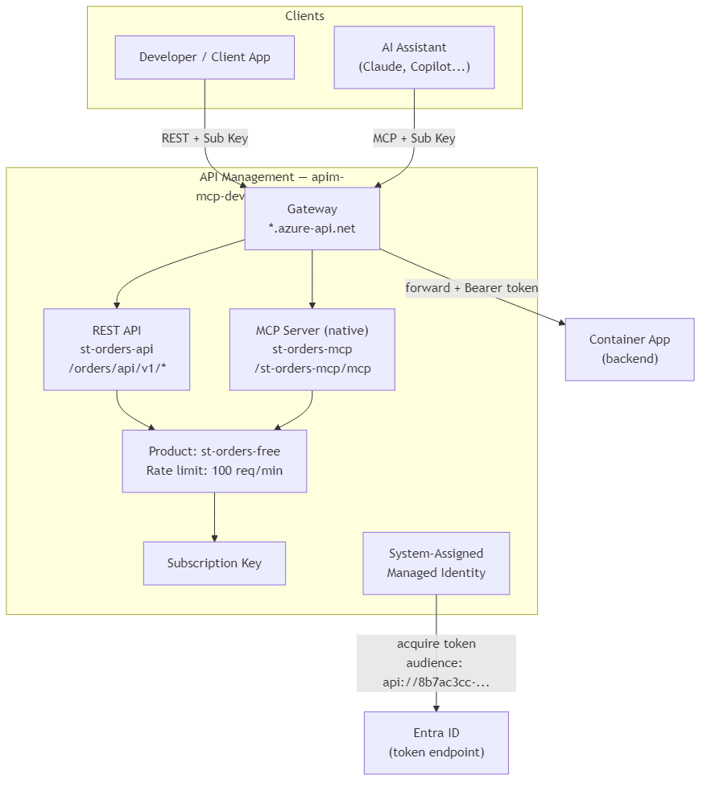
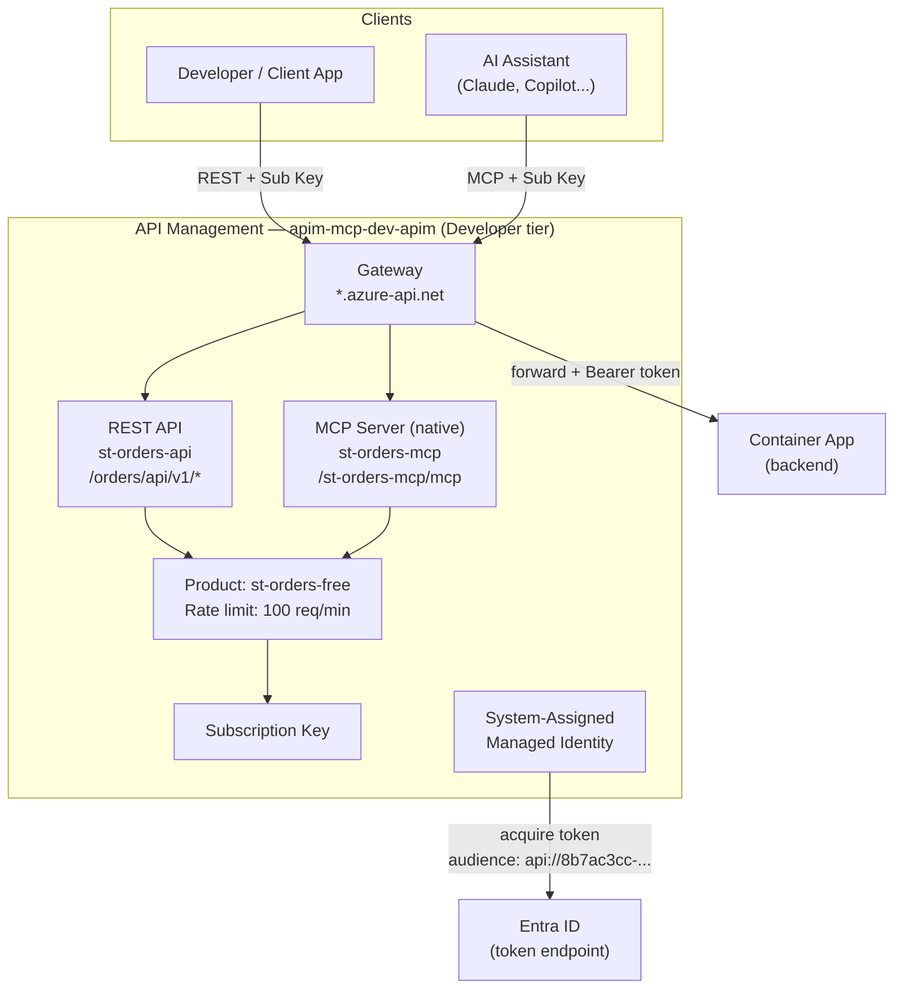
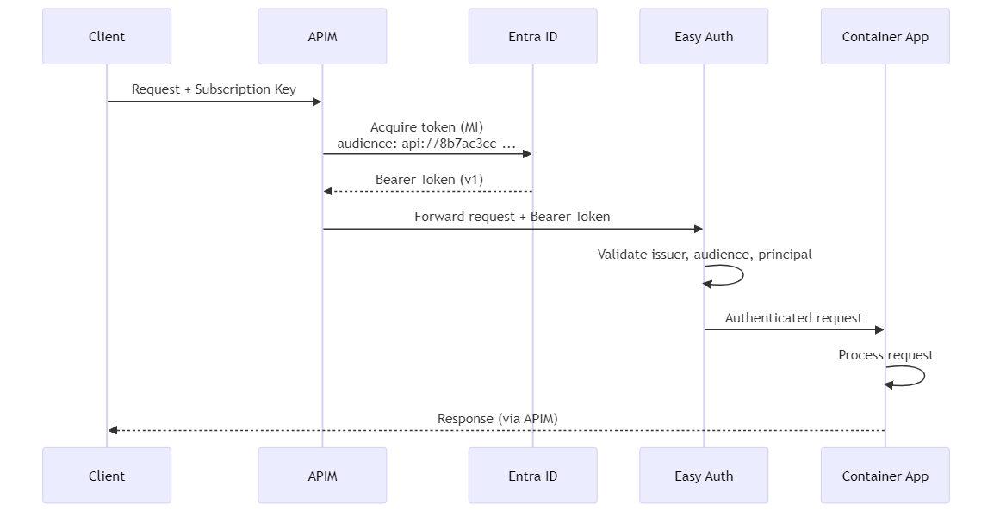
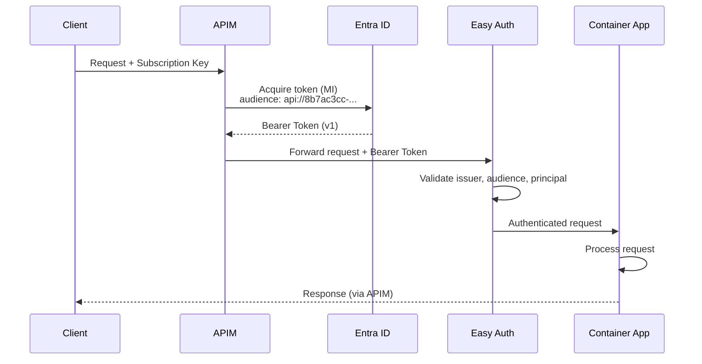
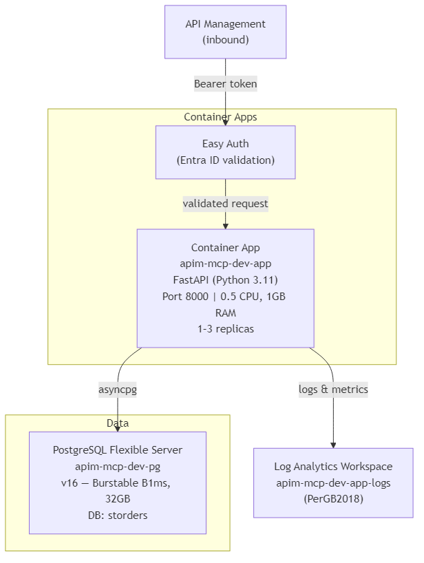
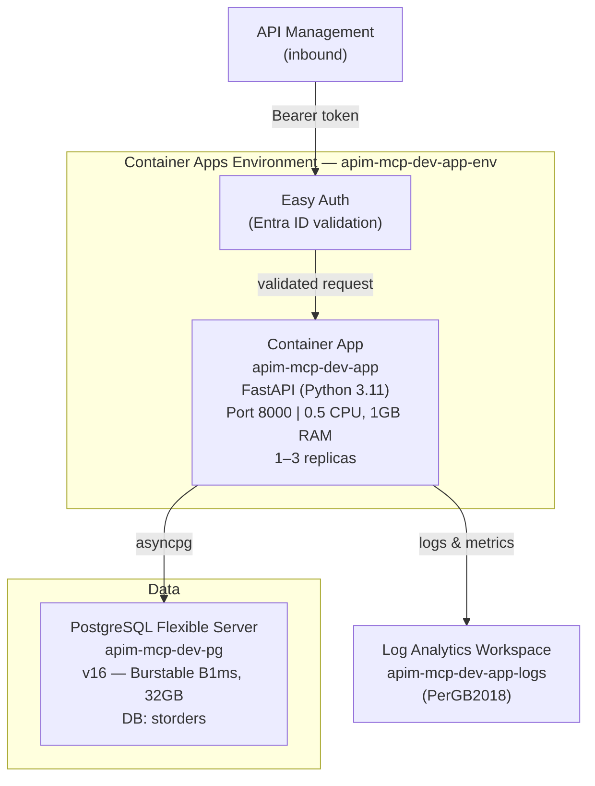
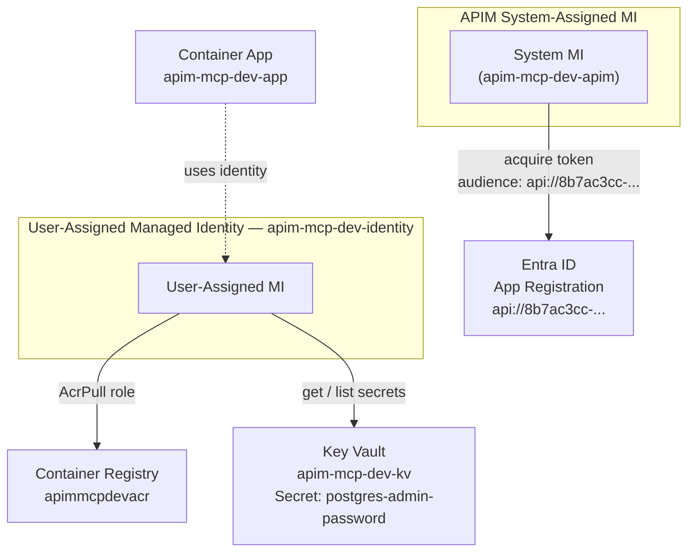
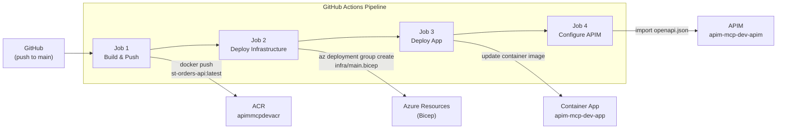

# Architecture - Microelectronics Orders API

Azure-based platform for managing semiconductor orders, exposed via REST API and native MCP server through Azure API Management.

## Azure Resources

**Resource Group:** `rg-poc-apim` | **Region:** `swedencentral`

| # | Resource | Azure Type | SKU/Tier | Name |
|---|----------|-----------|----------|------|
| 1 | Managed Identity | `Microsoft.ManagedIdentity/userAssignedIdentities` | - | `apim-mcp-dev-identity` |
| 2 | Key Vault | `Microsoft.KeyVault/vaults` | Standard | `apim-mcp-dev-kv` |
| 3 | Container Registry | `Microsoft.ContainerRegistry/registries` | Basic | `apimmcpdevacr` |
| 4 | PostgreSQL Flexible Server | `Microsoft.DBforPostgreSQL/flexibleServers` | Burstable B1ms | `apim-mcp-dev-pg` |
| 5 | PostgreSQL Database | (sub-resource of #4) | PostgreSQL 16 | `storders` |
| 6 | Log Analytics Workspace | `Microsoft.OperationalInsights/workspaces` | PerGB2018 | `apim-mcp-dev-app-logs` |
| 7 | Container Apps Environment | `Microsoft.App/managedEnvironments` | - | `apim-mcp-dev-app-env` |
| 8 | Container App | `Microsoft.App/containerApps` | 0.5 CPU, 1GB RAM, 1-3 replicas | `apim-mcp-dev-app` |
| 9 | Easy Auth (Entra ID) | `Microsoft.App/containerApps/authConfigs` | - | (on Container App) |
| 10 | API Management | `Microsoft.ApiManagement/service` | Developer | `apim-mcp-dev-apim` |
| 11 | APIM REST API | `Microsoft.ApiManagement/service/apis` | - | `st-orders-api` |
| 12 | APIM MCP API | `Microsoft.ApiManagement/service/apis` (preview) | apiType: mcp | `st-orders-mcp` |
| 13 | APIM Product | `Microsoft.ApiManagement/service/products` | - | `st-orders-free` |
| 14 | APIM Subscription | `Microsoft.ApiManagement/service/subscriptions` | - | `st-orders-free-subscription` |

## High-Level Overview



<details>
<summary>Mermaid source (click to expand)</summary>



</details>

## API Management



<details>
<summary>Mermaid source (click to expand)</summary>



</details>

## Authentication Flow



<details>
<summary>Mermaid source (click to expand)</summary>



</details>

## Container Apps & Data



<details>
<summary>Mermaid source (click to expand)</summary>



</details>

## Identity & Secrets


<details>
<summary>Mermaid source (click to expand)</summary>



</details>

## CI/CD Pipeline


<details>
<summary>Mermaid source (click to expand)</summary>



</details>

## MCP Tools

8 tools exposed via the native APIM MCP server (`st-orders-mcp`), each mapped to a REST API operation:

| Tool | REST Operation |
|------|---------------|
| `list_products_api_v1_products_get` | GET /api/v1/products |
| `get_product_api_v1_products__product_id__get` | GET /api/v1/products/{id} |
| `list_customers_api_v1_customers_get` | GET /api/v1/customers |
| `get_customer_api_v1_customers__customer_id__get` | GET /api/v1/customers/{id} |
| `list_orders_api_v1_orders_get` | GET /api/v1/orders |
| `get_order_api_v1_orders__order_id__get` | GET /api/v1/orders/{id} |
| `create_order_api_v1_orders_post` | POST /api/v1/orders |
| `update_order_api_v1_orders__order_id__put` | PUT /api/v1/orders/{id} |

**MCP Endpoint:** `https://apim-mcp-dev-apim.azure-api.net/st-orders-mcp/mcp`

## Bicep Modules

Infrastructure-as-Code is organized in `infra/`:

```
infra/
  main.bicep                    # Orchestrator
  modules/
    managed-identity.bicep      # User-assigned MI
    keyvault.bicep              # Key Vault + secrets
    acr.bicep                   # Container Registry + AcrPull role
    postgresql.bicep            # PostgreSQL + database
    container-app.bicep         # Environment + App + Easy Auth
    apim.bicep                  # API Management instance
    apim-api.bicep              # REST API definition
    apim-mcp.bicep              # MCP Server API (preview)
```
